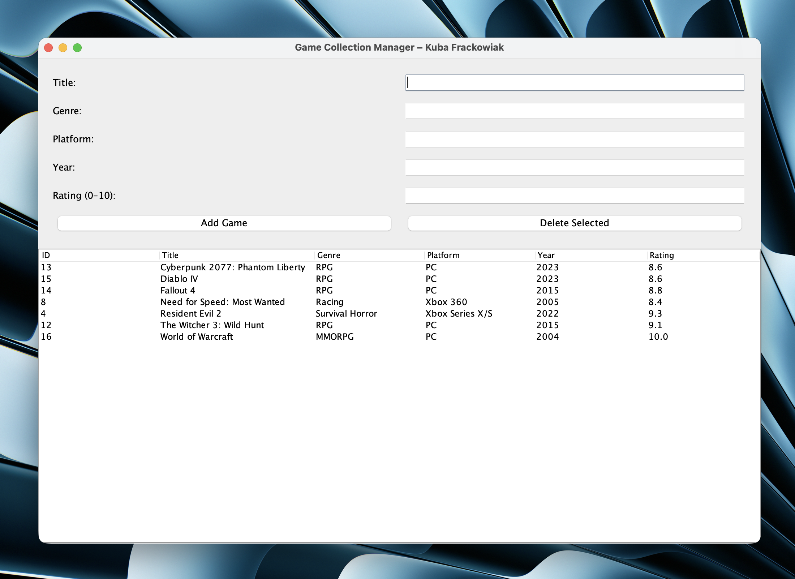

# Game Collection Manager – Kuba Frackowiak

Java + MySQL desktop application – portfolio project for Fife College HNC Computing: Software Development (August 2026).

## Features
- Add, delete, and view games
- Real MySQL database (JDBC)
- Clean Swing GUI
- Full CRUD operations

## Technologies
- Java 25 (Amazon Corretto)
- MySQL 9.5
- Swing

## Screenshot

Self-taught project – November 2025
